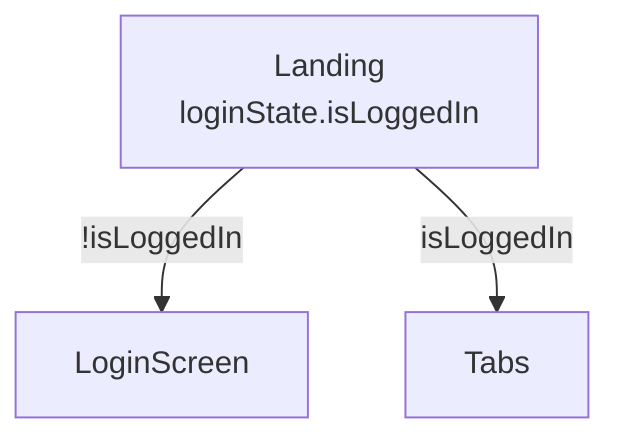
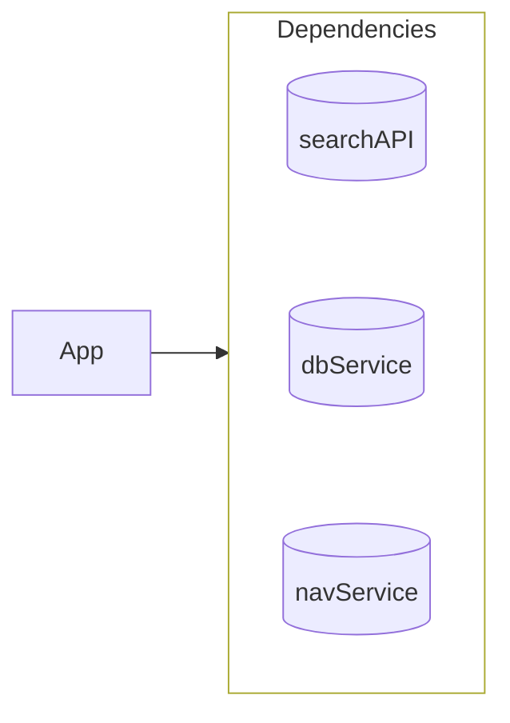

# hypermodular

**TDD is dead. Long live TDD: Top-Down Development.**

One map, one module, one boundary. An architecture method where the app is
modeled as small Mermaid maps that live in the repo, guide AI agents, and
can never rot — because the global view is derived, not maintained.

This repo is itself an agent skill: point Claude (or any agent that reads
`SKILL.md`) at it and it knows the method.

## The idea

Classic TDD — the mocks-all-the-way-down version that broke on every
refactor — deserved to die. What's worth keeping is the part that keeps an
AI agent honest: fast feedback it can't talk its way out of. Hypermodular
delivers that with two declarations instead of rituals:

- **Structure before code.** The app is a tree of behavior, drawn before
  it's built. Development flows from the root to the leaves. An unbuilt
  node is a bare leaf on the map — mapped, reachable, empty. That's
  finished design, not missing work.
- **Evidence, not effects.** A node's behavior is declared as data: these
  values in, this evidence out — the ordered log of its boundary calls.
  No mocks, ever: a boundary in a spec is just a logger, and checking a
  node is comparing two values.

## One law: depth 1

Every artifact describes exactly one boundary — its own.

- A logged boundary never simulates deeper than one step (mock depth 1).
- Injection enters the app at exactly one place — the root.
- A map draws exactly one level — a node and its immediate children.

Same law, three shadows. It's what keeps mocks, dependencies, and
documentation honest simultaneously.

## The three diagrams

Every mapped node answers three questions, each with one small Mermaid
diagram in a `MAP.md` beside its code (`APP-MAP.md` at the repo root).

**1. Structure tree** — what is it made of? Solid arrows are data flow:
parent hands the child facts, bindings, and callbacks. A node's label
carries its whole contract — `@` lines materialize (native sources of
truth like `@Query`), dotted lines call (`dbService.updateBook`).

A decision is just a node with labeled alternative arrows — no diamonds,
no flow-chart theater. LoginScreen is an unbuilt leaf: nobody knows or
cares yet what's inside, and that's the point of top-down.

**2. Data coupling layer** — what vocabulary is shared? Models and service
signatures, consumption recorded with `..>`. Coupling is consumption, not
visibility: everything is visible to everyone; only *use* creates a line.

**3. Dependencies** — what does the app ask of the world? All services as
cylinders in one box, injected by the root with one plain arrow (injection
is normal data flow). The column is ordered top-to-bottom in injection
order; a derived service lists its ingredients, which must sit above it.
Every dependency is an environment value: a plain struct composed of
closures, lets, or bindings. No protocols, no classes.

Even navigation is just a dependency: `navService.showDetail(id)` — the
caller never knows which node answers, and cross-feature arrows are
forbidden. The navigation state lives at the root; callers get closures.

## Hypermodular

One mermaid is one module is one boundary. No map knows more than one
level. The whole app reconstructs by merging nodes on their names — so the
global architecture view is always *derivable* and never *maintained*.
Hand-maintained architecture docs rot; a derived view can only reveal
disagreements between maps, which are exactly the bugs you want surfaced.

Contracts are deliberately duplicated — a node's full label appears in its
parent's map and in its own. That's double-entry bookkeeping: the merge
compares the copies, and a mismatch is a detected, unreviewed design
change.

## Use it

- **Claude app / Cowork**: save `hypermodular/SKILL.md` as a skill (or
  install the `.skill` release) — then ask Claude to "map this project" or
  "plan this app top-down".
- **Claude Code CLI**: symlink (or copy) this repo's `hypermodular/`
  folder to `~/.claude/skills/hypermodular`, or just work in a repo
  containing `APP-MAP.md` — the `CLAUDE.md` here teaches the CLI the
  rules.
- **Reverse-engineering**: point the skill at an existing codebase and it
  extracts the maps — the first map of a legacy project is a free
  architecture review.

## The shelf

- **[swift-core-flow](https://github.com/sisoje/swift-core-flow)** — the
  mechanics: macros for the functional-core / imperative-shell split,
  evidence logging, testing SwiftUI views as pure cores.
- **[swiftui-mv-architecture](https://github.com/redhotbits/swiftui-mv-architecture)** —
  the style: MV over MVVM/TCA; what a node's code should look like.
- **hypermodular** (this repo) — the method: draw the maps, develop
  top-down, let evidence keep everyone honest.

## Origin

This method was distilled in one long conversation that started as a
LinkedIn reply about whether TDD is dead. It is — the acronym just needed
a new expansion.
