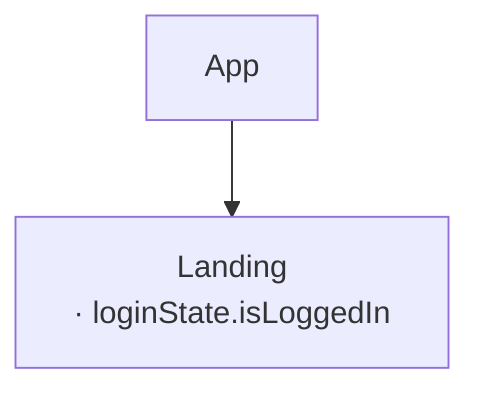
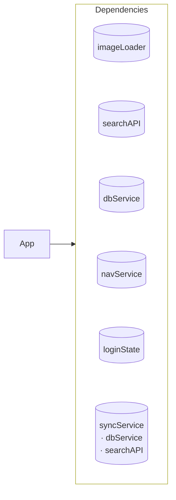
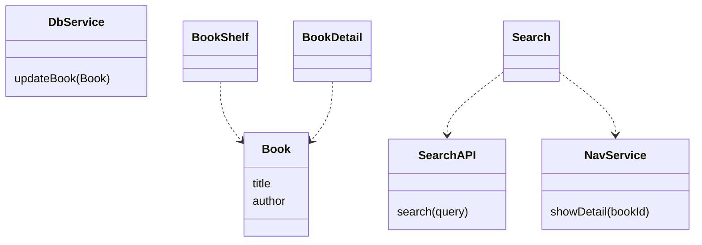

# Book app

```mermaid
%% Root: App
flowchart TD
    App --> Landing["Landing<br/>· loginState.isLoggedIn"]
```

```mermaid
%% Root: App · Dependencies
flowchart LR
    subgraph Dependencies
        direction TB
        imageLoader[(imageLoader)]
        searchAPI[(searchAPI)]
        dbService[(dbService)]
        navService[(navService)]
        loginState[(loginState)]
        syncService[("syncService<br/>· dbService<br/>· searchAPI")]
        imageLoader ~~~ searchAPI ~~~ dbService ~~~ navService ~~~ loginState ~~~ syncService
    end

    App --> Dependencies

    classDef deps fill:none
    class Dependencies deps
```

```mermaid
%% Root: App · Coupling
classDiagram
    class Book {
        title
        author
    }
    class DbService {
        updateBook(Book)
    }
    class NavService {
        showDetail(bookId)
    }
    class SearchAPI {
        search(query)
    }

    BookShelf ..> Book
    BookDetail ..> Book
    Search ..> SearchAPI
    Search ..> NavService
```
