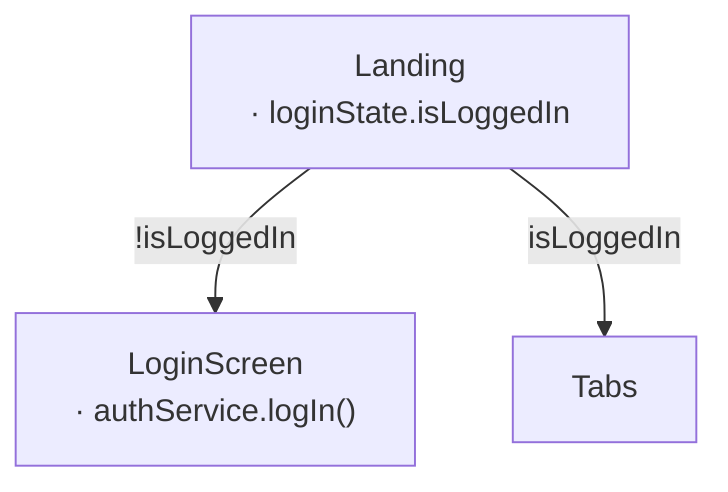

```mermaid
%% Root: Landing · Parent: App (../APP-MAP.md)
flowchart TD
    Landing["Landing<br/>· loginState.isLoggedIn"] -->|!isLoggedIn| LoginScreen["LoginScreen<br/>· authService.logIn()"]
    Landing -->|isLoggedIn| Tabs
```
