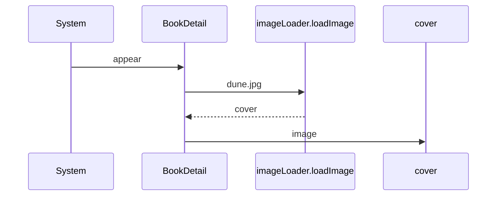
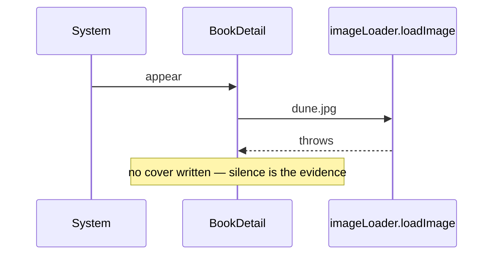

## Evidence

```mermaid
%% Evidence: BookDetail · Parent: BookShelf (../MAP.md)
%% Given: book Dune · imageLoader returns cover
sequenceDiagram
    System->>BookDetail: appear
    BookDetail->>imageLoader.loadImage: dune.jpg
    imageLoader.loadImage-->>BookDetail: cover
    BookDetail->>cover: image
```

```mermaid
%% Evidence: BookDetail · Parent: BookShelf (../MAP.md)
%% Given: book Dune · imageLoader throws
sequenceDiagram
    System->>BookDetail: appear
    BookDetail->>imageLoader.loadImage: dune.jpg
    imageLoader.loadImage-->>BookDetail: throws
    Note over BookDetail: no cover written — silence is the evidence
```
