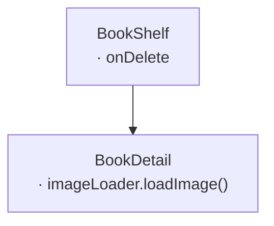
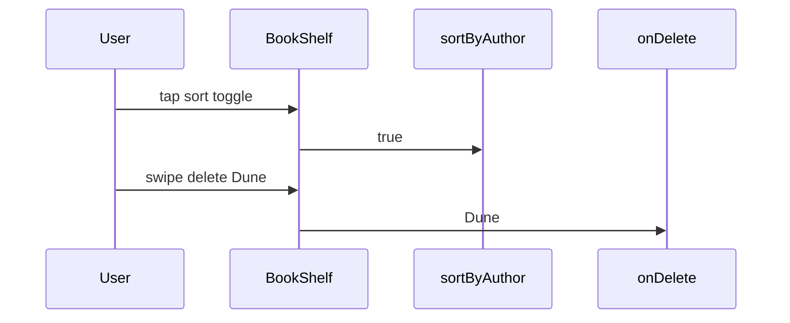

```mermaid
%% Root: BookShelf · Parent: Library (../MAP.md)
flowchart TD
    BookShelf["BookShelf<br/>· onDelete"] --> BookDetail["BookDetail<br/>· imageLoader.loadImage()"]
```

## Evidence

```mermaid
%% Evidence: BookShelf · Parent: Library (../MAP.md)
%% Given: books [Dune] · sortByAuthor false
sequenceDiagram
    User->>BookShelf: tap sort toggle
    BookShelf->>sortByAuthor: true
    User->>BookShelf: swipe delete Dune
    BookShelf->>onDelete: Dune
```
