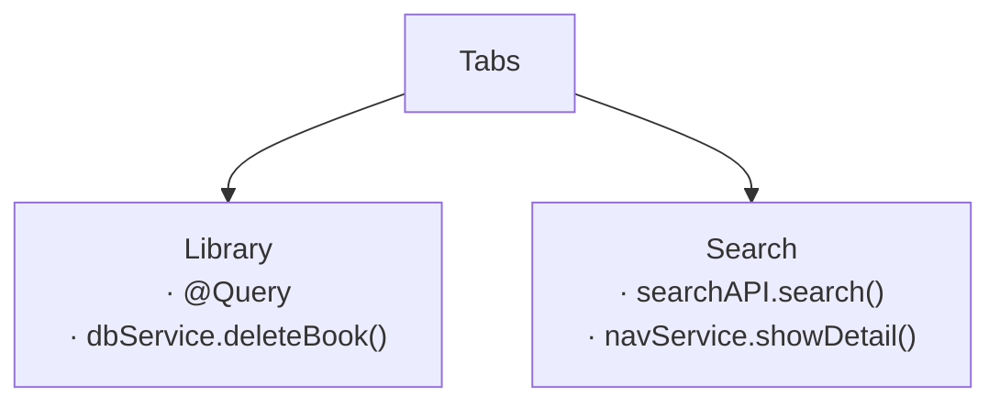

```mermaid
%% Root: Tabs · Parent: Landing (../MAP.md)
flowchart TD
    Tabs --> Library["Library<br/>· @Query<br/>· dbService.deleteBook()"]
    Tabs --> Search["Search<br/>· searchAPI.search()<br/>· navService.showDetail()"]
```
