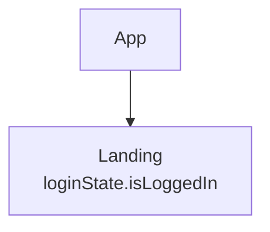
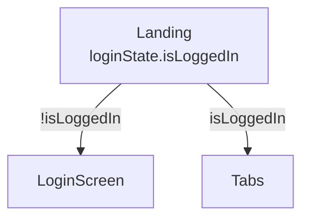
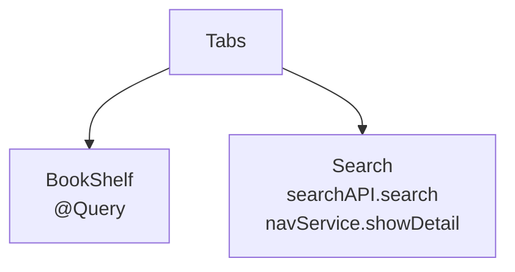
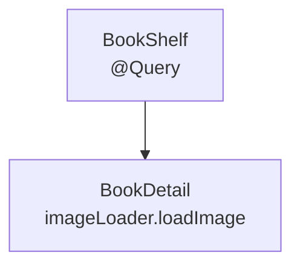
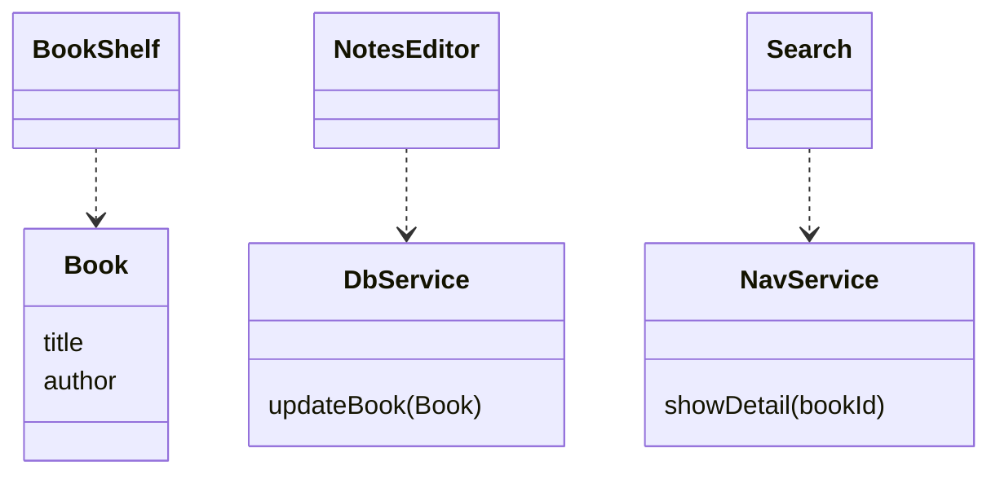
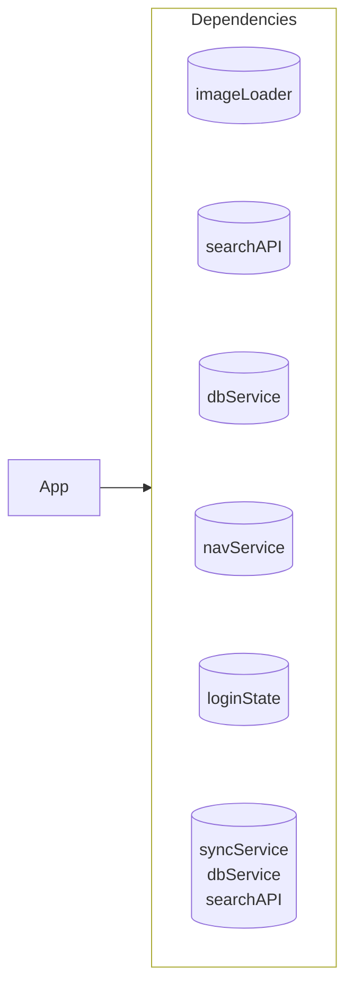

# hypermodular — Top-Down Development behavioral mapping

TDD means **Top-Down Development**: the app is modeled as a tree of
behavior before it is built; development flows from the root toward the
leaves; each node's evidence is declared before its code. The map is
Mermaid in markdown (`APP-MAP.md` at the repo root, `MAP.md` beside each
mapped subtree), so it renders in every GitHub/GitLab PR — always
visible, always diffable.

The map is behavioral, not an inventory: it shows where decisions live
and what they ask of the world, nothing else. Renaming a button never
touches it; moving a decision always does.

The architecture this produces is **hypermodular**: one mermaid is one
module is one boundary. No map knows more than one level, and the whole
app is reconstructable by merging nodes on their names — so the global
view is always derivable and never maintained.

## The three rules

1. **Build top-down.** Implement a node only after its parent exists.
   New features are drawn on the map before any code is written.
2. **Respect the map.** When working on a node, touch only that node's
   own code and the capabilities named in its own label. Needing one
   that isn't on the map means stopping and proposing a map change
   first — that diff is the design review.
3. **Evidence, not effects.** A node's behavior is declared as data:
   these values in, this evidence out — the ordered log of the node's
   boundary calls with payloads. Declare the evidence before
   implementing; implementation means making the declaration hold. Never
   observe effects behind a boundary, never simulate behavior (no
   mocks): a boundary in a spec is a logger, and checking a node is
   comparing two values.

## One law: depth 1

Every artifact describes exactly one boundary — its own. A logged
boundary never simulates deeper than one step. Injection enters only at
the root. And a map draws only one level: a node and its immediate
children. This is what keeps all three honest.

## Diagram 1: the structure tree

A `flowchart TD`, one level deep.

- **Solid arrow `-->`** = data flow. Parent hands the child its data,
  bindings, and callbacks; the child never reaches up or sideways.
  Cross-feature arrows are forbidden — features communicate through
  data and capabilities (navigation goes through `navService`; which
  node answers a route is composed up the tree).
- **Mermaid id = node name, always.** Write
  `BookShelf["BookShelf @Query"]`, never a short alias id.
  The name is the join key that merges maps back into one tree; ids
  that differ from names break the merge silently. Redundant to type,
  free for an AI.
- **Node label = name on the first line, then one contract line per
  line**, using ` `. Two kinds of line, distinguishable at a
  glance and by parser: lines starting with `@` **materialize** — 
  sources of truth held as property wrappers, wrapper name only
  (`@Query`, `@AppStorage` — what the node derives from them, like an
  isLoggedIn computed off a token, is code's business, not the map's);
  lines with a dot **call** — `<dep>.<func>`
  (`dbService.updateBook`). Calls produce
  evidence; materialization doesn't. The lines under the name are the
  node's entire relationship with the world and the exact vocabulary
  allowed in its evidence. A name-only label receives everything and
  calls nothing. Nothing else ever goes in a label.
- **A node is a collapsed subtree.** The screen plus all its view
  furniture (rows, buttons, design-system pieces) is one node; internal
  attribution is meaningless — the node's contract is what crosses its
  edge. A subtree becomes its own node only when it joins the app
  lifecycle independently: own outliving state, appearance work,
  navigation destination, or its own boundary call.
- **A decision marks its alternative arrows with the deciding value.**
  No diamonds — deciding is what nodes do — but alternatives are
  structural: an agent must know whether children coexist or exclude
  each other. Unlabeled solid arrows = composition (children exist
  together); labeled arrows = alternatives, labeled with the value that
  selects them (`-->|isLoggedIn|`, `-->|!isLoggedIn|`), which the
  node's contract line already names (`loginState.isLoggedIn`). The
  label states possibility, never sequence — what happens is the
  evidence log's business.
- **Unbuilt nodes are bare leaves** — mapped, reachable, empty. The map
  runs ahead of the code; a leaf with no insides is finished design.
- Shell/core split (imperative shell hosting the machinery, pure core
  taking values and closures — CoreFlow style) is implementation detail
  and never drawn.

One module = one mermaid, chopped at every level. A node carries its
full contract everywhere it appears — as a child in its parent's map and
as the root of its own. The duplication is deliberate: it's double-entry
bookkeeping. Every block opens with a `%%` comment declaring its place,
so an extracted mermaid still knows where it belongs. The root map:

Landing's map (the login gate — a decision node):

Tabs' map (unlabeled arrows — plain composition):

BookShelf's map, beside its code:

Leaves get no map of their own — we are modeling data flow, and a map
earns its existence by having arrows: flow to show. A leaf has no
internal flow; its contract lives in its parent's map (its only
appearance), and the day a leaf grows children, its map is born
together with them.

Merging these on their shared node names reconstructs the whole tree —
the hypermodular property, demonstrated.

## Diagram 2: the data coupling layer

A `classDiagram` of the shared vocabulary: models and service
signatures. Field names without elaboration; services as bare closure
signatures; `..>` records consumption. Coupling is consumption, not
visibility — everything is visible to everyone, and only use creates a
line.

Read it diagnostically: modules sharing many types are secretly one
module; a type referenced everywhere is core domain, expensive to change.

## Diagram 3: dependencies

The world's surface and one fact about it: the root injects all of it.
No usage lines — usage is written on the nodes themselves (Diagram 1).

- Cylinders are surfaces nodes must **call**: writes and commands
  (`dbService` is writes only), non-native fetches (`imageLoader`,
  `searchAPI`), capabilities (`navService` — closures over root-owned
  navigation state). Native materialization (`@Query`, `@AppStorage`)
  is not a dependency: it's facts arriving, tagged in the node label.
- **A dependency is an environment value: a plain struct composed of
  closures, lets, or bindings.** Pure value, no protocols, no classes,
  no reference-type service objects — capabilities as closures, facts
  as lets, shared mutable state as bindings, mixed freely in one
  struct. The live implementation, the preview stub, and the logging
  spec host are just different member sets of the same struct.
  Injection means putting a value into the environment; deriving means
  building a new value from values already there. Nothing else.
- Name the boundary, not the tech: `dbService`, not `swiftData`.
- **Injection is normal data flow.** One solid arrow `-->` from the
  root into the Dependencies box: App hands values to the environment,
  the same way a parent hands values to a child. A second arrow into
  the box means injection leaked into the tree.
- **The column is ordered: top to bottom is injection order.** The
  invisible `~~~` chain is semantic, not layout — injectors are
  typically view modifiers applied in sequence, and a later injector
  may read services already in the environment and combine them into a
  new one. A **derived service** uses the node-label grammar: name on
  the first line, then one line per ingredient it reads —
  `syncService[("syncService dbService searchAPI")]`. Its
  ingredients must appear **above it** in the column; an ingredient
  below is an order violation you can see. The injector modifiers
  themselves are implementation detail and never drawn.
- `fill:none` on every box; stack cylinders with invisible `~~~` links.

The box's size is a health metric on its own.

## Combining maps (identity rules)

Depth-1 maps must recombine into one tree mechanically. Any agent (or
script) must be able to answer "which node belongs where" from the files
alone:

- **One name, one node.** Node display names are globally unique across
  the whole app and identical everywhere the node appears: as a leaf in
  its parent's map and as the root of its own. The name is the join key.
- **Same contract everywhere — deliberately duplicated.** A node's full
  label (name + contract lines) is identical as a child in its parent's
  map and as the root of its own. This is double-entry bookkeeping: the
  reconstruction check compares the copies, and any mismatch is a
  detected, unreviewed design change — single-sourcing would have
  nothing to compare. Changing a contract therefore touches parent map
  and child map in the same commit, which is exactly the design review.
- **A map exists only where there are arrows.** Nodes with children get
  their own map; leaves don't — a leaf's contract lives in its parent's
  map, its only appearance. (Duplication applies only to nodes that
  appear twice; a leaf has one entry, so nothing to cross-check.)
- **Every mermaid block declares its place** as its first line, inside
  the block: `%% Root: BookDetail · Parent: BookShelf (../MAP.md)`. The
  root map's comment is `%% Root: App`. The block stays self-contained
  when extracted; following parent links upward reaches `APP-MAP.md`,
  following names downward reaches any node.
- **Reconstruction check**: parent links form a single tree with no
  orphans, and every leaf that has its own MAP.md is reachable. When
  maintaining maps, verify this before committing.

## Workflows

**Reverse-engineering an existing project.** Walk the instantiation
graph from the entry point downward (solid arrows). Find every I/O
touchpoint — network, storage, DI/environment, timers, notifications —
and attribute each call to the node that decides it (its contract
lines); each service becomes a cylinder. Apply the cuts while
walking; don't inventory first. Collect shared models and service
signatures into the coupling diagram. Verify injection happens only at
the root; flag violations as findings. Write the maps depth-1 with
identity headers, then present the two or three most interesting things
they reveal — the first map of a codebase is a free architecture review.

**Starting a new app or feature.** Draw before building; iterate on the
diagram with the user — it's cheap, that's the point. Unbuilt leaves are
finished design. Once agreed, build root-down, each node's evidence
declared before its code. New features enter the map first, and the map
diff is the design review.

**Maintaining.** The map is code: any change that moves a decision,
changes a contract, or adds a capability updates the affected maps in
the same commit. In a mapped repo, read `APP-MAP.md` before reading
code, and treat rule 2 as the work fence. If map and reality disagree,
say so and fix one of them — never silently work around.

## Style

Short ids, real names in labels. No colors, no emoji, no fills, no
status markers — whether a node's declared evidence holds is the only
"done" that exists, and it lives in the repo, not the map.
