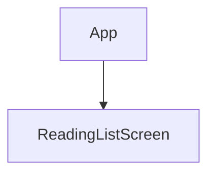
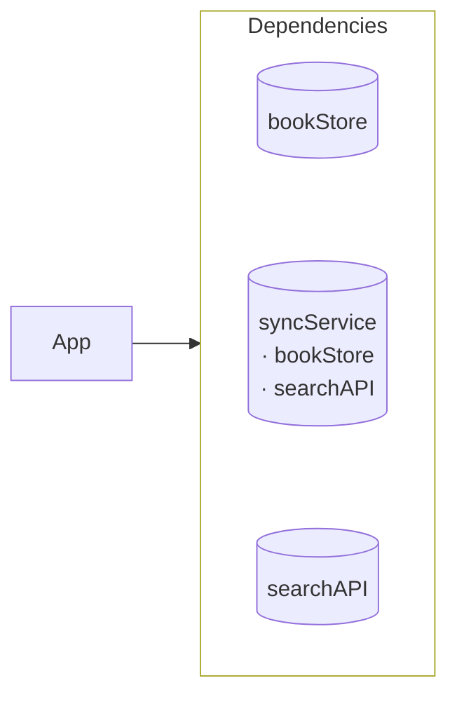
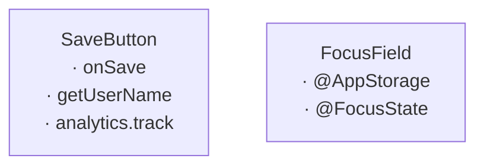

# CoreFlowExample

```mermaid
%% Root: App
flowchart TD
    App --> ReadingListScreen
```

```mermaid
%% Root: App · Dependencies
flowchart LR
    subgraph Dependencies
        direction TB
        syncService[("syncService<br/>· bookStore<br/>· searchAPI")]
        bookStore[(bookStore)]
        searchAPI[(searchAPI)]
        bookStore ~~~ syncService ~~~ searchAPI
    end
    App --> Dependencies
    classDef deps fill:none
    class Dependencies deps
```

## Unmounted

```mermaid
%% Root: App · Unmounted
flowchart TD
    SaveButton["SaveButton<br/>· onSave<br/>· getUserName<br/>· analytics.track"]
    FocusField["FocusField<br/>· @AppStorage<br/>· @FocusState"]
```
