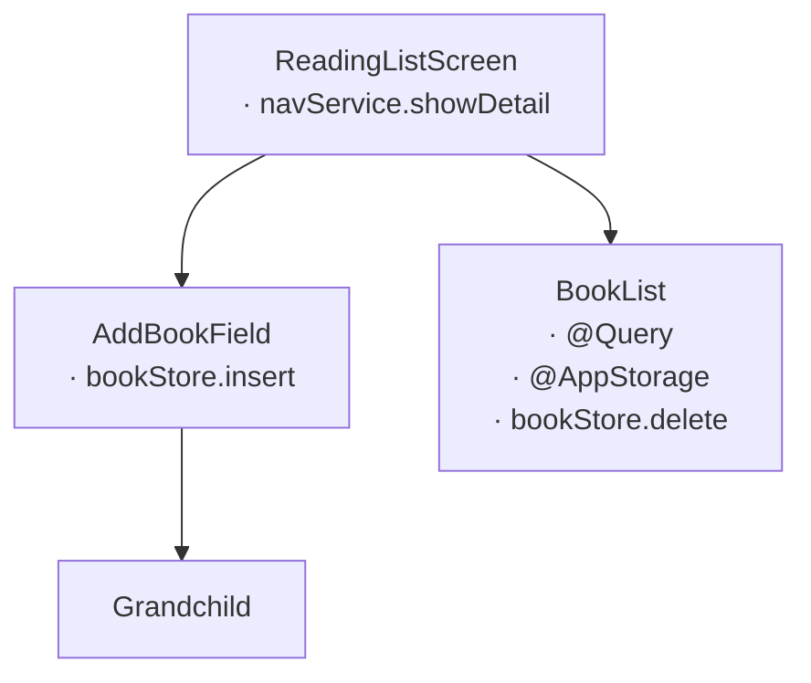

```mermaid
%% Root: ReadingListScreen · Parent: App (../APP-MAP.md)
flowchart TD
    ReadingListScreen["ReadingListScreen<br/>· navService.showDetail"] --> AddBookField["AddBookField<br/>· bookStore.insert"]
    ReadingListScreen --> BookList["BookList<br/>· @Query<br/>· @AppStorage<br/>· bookStore.delete"]
    AddBookField --> Grandchild
```
