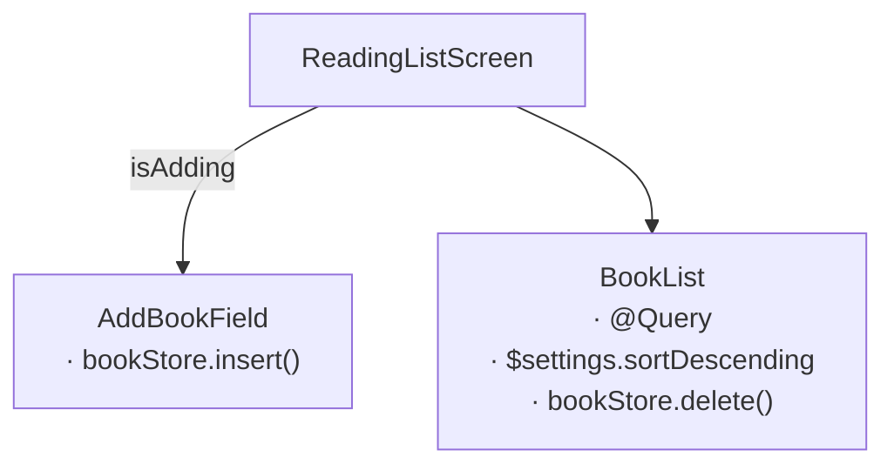

```mermaid
%% Root: ReadingListScreen · Parent: App (../APP-MAP.md)
flowchart TD
    ReadingListScreen -->|isAdding| AddBookField["AddBookField<br/>· bookStore.insert()"]
    ReadingListScreen --> BookList["BookList<br/>· @Query<br/>· $settings.sortDescending<br/>· bookStore.delete()"]
```
